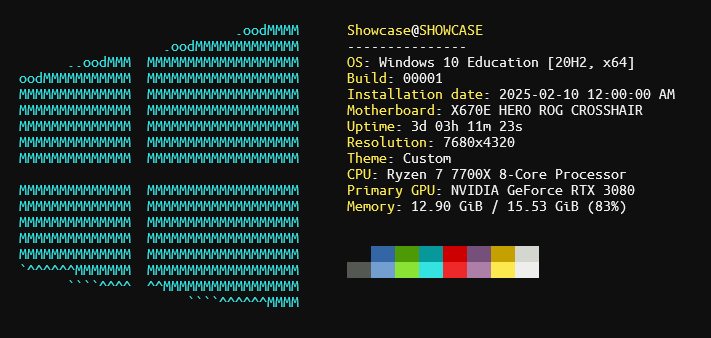

<h3 align="center"></h3>

An adaptation of

made in C#

#

 

Command-line utility developed in `C# .NET 8.0`, designed to provide comprehensive and aesthetically formatted system diagnostics. It delivers a streamlined overview of essential system parameters for users seeking an efficient, visually engaging representation of system specifications.

# 
- **Platform Support**: Currently compatible with Windows 10/11; possible future iterations may extend support to Linux and other operating systems.
- **Terminal Integration**: Runs seamlessly on `Command Prompt` and `Windows Terminal`.
- **System Information Display**:
  - `Operating System` & `Build Version`
  - `Installation Date`
  - `Motherboard Model`
  - `System Uptime`
  - `Display Resolution`
  - `Active Theme`
  - `CPU Model`
  - `Primary GPU`
  - `Memory Usage Statistics`
 
## Installation
1. Visit the [Releases](https://github.com/nycalexander/neosharp/releases) section on GitHub and download the latest compiled artifact
2. Run `neosharp.exe` within your terminal or directly.
   
**(Optional)** Add `neosharp.exe` to `PATH` in the System Environment Variables for global usage of the command `neosharp`.

## Compatibility
- **Operating System**: Windows 10, Windows 11
- **Framework**: .NET 8.0

## License
This project is licensed under the GPLv2 License. See `LICENSE` for details.
